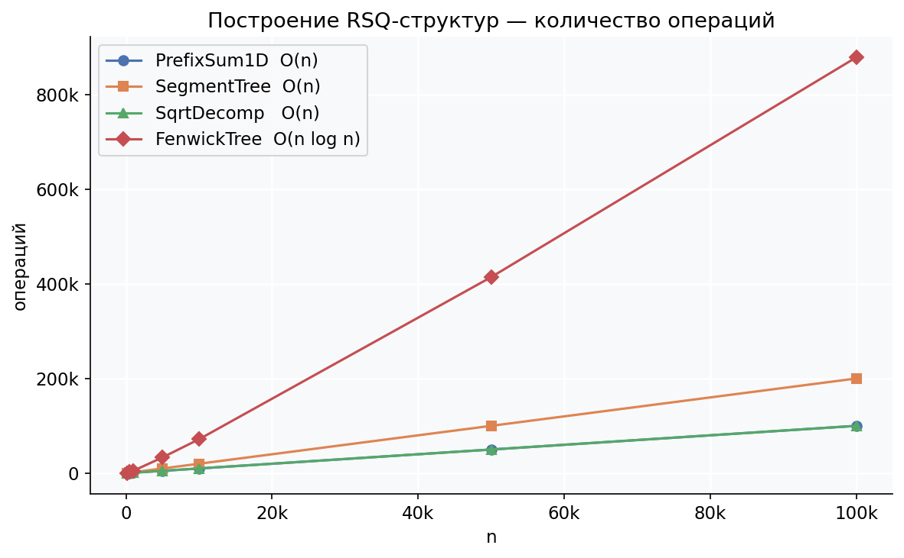
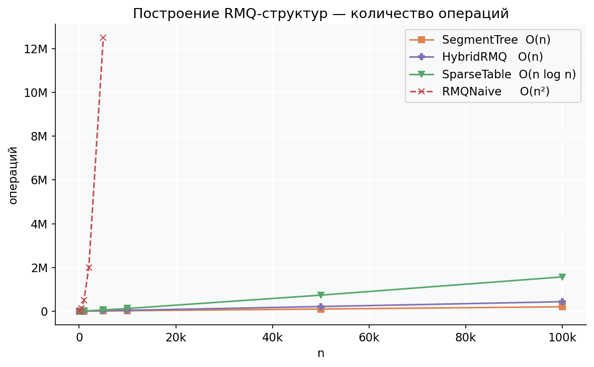
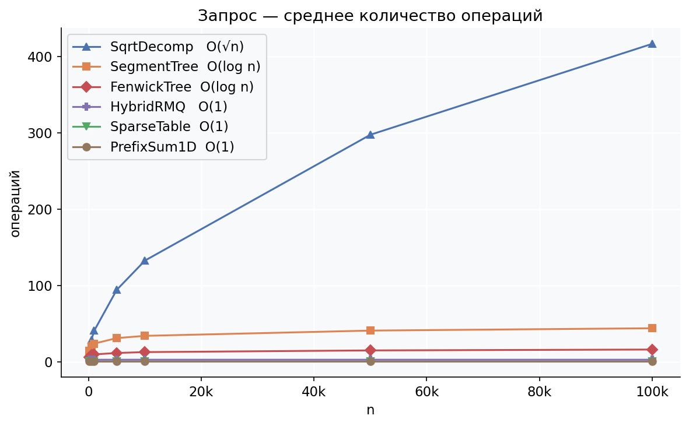
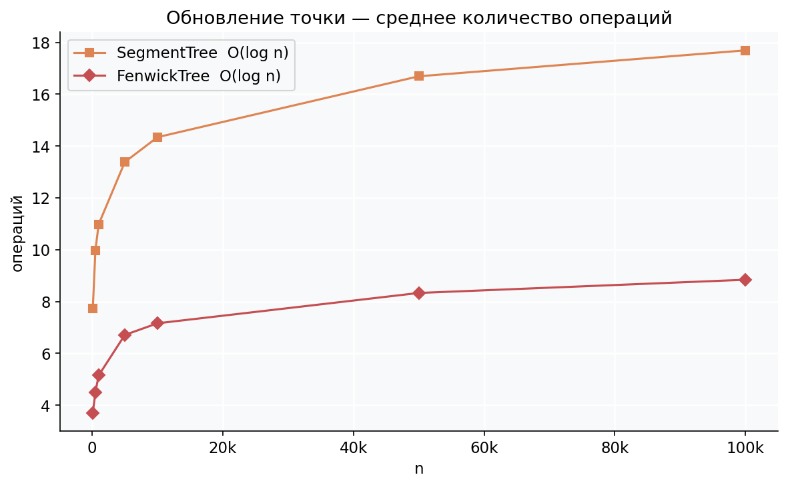
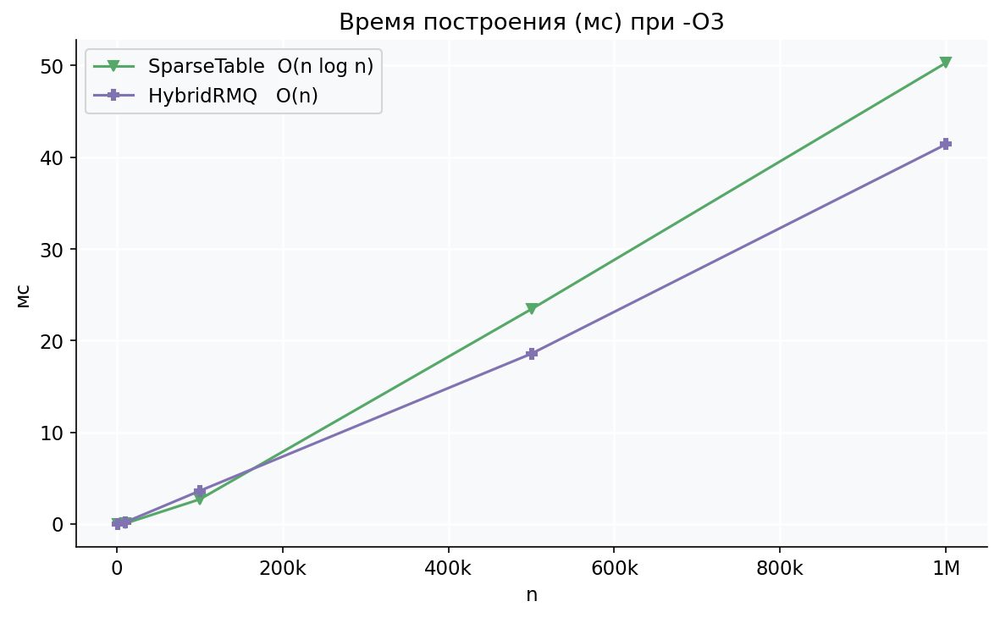
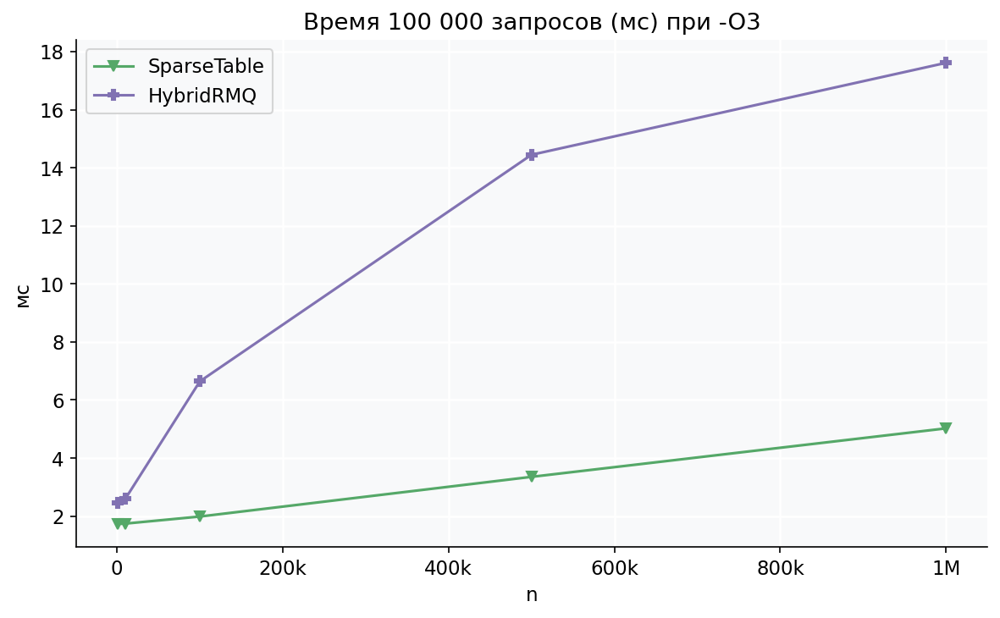

# Лабораторная работа №3 — Range Query Data Structures

Реализация структур данных для задач **RSQ** (Range Sum Query) и **RMQ** (Range Minimum Query).
Для каждой структуры подсчитываются ключевые операции при построении и запросе, а также замеряется реальное время работы.

## Структура проекта

```
├── include/          # заголовочные файлы (.h)
├── src/              # реализации (.cpp) + main.cpp
├── tests/            # тесты (Catch2)
├── docs/
│   ├── plot.py       # скрипт генерации графиков
│   └── img/          # графики
└── CMakeLists.txt
```

## Сборка и запуск

```bash
cmake -S . -B build
cmake --build build

# бенчмарк
./build/lab3

# тесты
./build/lab3_tests
```

Для генерации графиков:
```bash
python3 docs/plot.py
```

---

## Реализованные структуры

### 1. PrefixSum1D — 1D RSQ

Префиксная сумма. `prefix[i] = a[0] + ... + a[i-1]`, запрос `[l,r] = prefix[r+1] - prefix[l]`.

| Build | Query |
|-------|-------|
| O(n)  | O(1)  |

---

### 2. PrefixSum2D — 2D RSQ

Двумерная префиксная сумма. Запрос прямоугольника через формулу включений-исключений (3 операции).

| Build | Query |
|-------|-------|
| O(n²) | O(1)  |

---

### 3. RMQNaive — 1D RMQ (все отрезки)

Предпросчёт минимума для всех пар `(l, r)`. `table[l][r] = min(table[l][r-1], a[r])`.

| Build | Query |
|-------|-------|
| O(n²) | O(1)  |

---

### 4. SqrtDecomposition — RSQ и RMQ

Шаблонный класс, операция передаётся лямбдой:

```cpp
auto sumOp = [](int a, int b) { return a + b; };
SqrtDecomposition<int, decltype(sumOp)> sq(sumOp, 0);
sq.build(arr);
```

Массив делится на блоки размером `√n`. Крайние неполные блоки обходятся поэлементно, средние — по блокам.

| Build | Query  | Update |
|-------|--------|--------|
| O(n)  | O(√n)  | O(√n)  |

---

### 5. SegmentTree — RSQ и RMQ

Шаблонное дерево отрезков с поддержкой точечного обновления. Операция передаётся лямбдой.

| Build | Query    | Update   |
|-------|----------|----------|
| O(n)  | O(log n) | O(log n) |

---

### 6. FenwickTree — RSQ

Дерево Фенвика (BIT). Каждый узел хранит сумму диапазона, определяемого младшим битом индекса.

| Build       | Query    | Update   |
|-------------|----------|----------|
| O(n log n)  | O(log n) | O(log n) |

---

### 7. SparseTable — RMQ

`table[k][i]` = минимум на `[i, i + 2ᵏ - 1]`. Запрос двумя перекрывающимися степенями двойки — всегда одна операция сравнения.

| Build      | Query |
|------------|-------|
| O(n log n) | O(1)  |

---

### 8. HybridRMQ — RMQ (Sqrt + Sparse Table)

Комбинация корневой декомпозиции и разреженной таблицы. Массив делится на блоки размером `B = ⌊log₂(n)/2⌋`. Внутри каждого блока и поверх блочных минимумов строится разреженная таблица. Это даёт O(n) построение при сохранении O(1) запроса.

Запрос `[l, r]` — три O(1) шага:
1. Левый неполный блок — внутренняя sparse table
2. Средние полные блоки — внешняя sparse table
3. Правый неполный блок — внутренняя sparse table

| Build | Query |
|-------|-------|
| O(n)  | O(1)  |

При n = 100 000: HybridRMQ строится за 433 631 операцию, SparseTable — за 1 568 946 (выигрыш в 3.6×).

---

## Графики

### Построение RSQ-структур



### Построение RMQ-структур



### Среднее количество операций на запрос



### Среднее количество операций на обновление



### Реальное время построения (мс, `-O3`)



На больших n (≥ 500 000) HybridRMQ начинает выигрывать у SparseTable по времени построения, что подтверждает теоретическое O(n) vs O(n log n).

### Реальное время 100 000 запросов (мс, `-O3`)



---

## Итоговая таблица сложностей

| Структура        | Build      | Query    | Update   |
|------------------|------------|----------|----------|
| PrefixSum1D      | O(n)       | O(1)     | —        |
| PrefixSum2D      | O(n²)      | O(1)     | —        |
| RMQNaive         | O(n²)      | O(1)     | —        |
| SqrtDecomposition| O(n)       | O(√n)    | O(√n)    |
| SegmentTree      | O(n)       | O(log n) | O(log n) |
| FenwickTree      | O(n log n) | O(log n) | O(log n) |
| SparseTable      | O(n log n) | O(1)     | —        |
| HybridRMQ        | O(n)       | O(1)     | —        |


